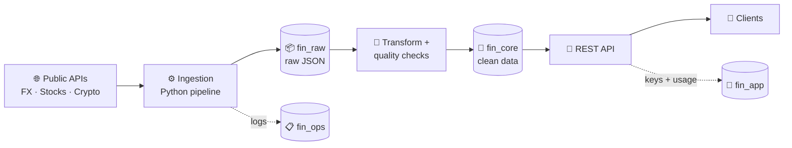

# 📈 FinPulse

**A production-grade financial data platform built on MySQL.**
FinPulse collects market data (FX rates, stock and crypto prices) from public APIs, cleans and validates it, stores it in a layered MySQL database, and serves it to clients through a secure REST API.


> 🚧 This project is built in public, phase by phase. Each phase is documented in [`docs/`](docs/).

---

## 🏗️ Architecture



| Schema | Role |
|---|---|
| `fin_raw` | Landing zone: API responses stored exactly as received (replayable) |
| `fin_core` | Clean, typed, constrained data: currencies, FX rates, assets, daily prices |
| `fin_ops` | Pipeline observability: run history and data-quality results |
| `fin_app` | API consumers: clients, hashed API keys, request logs |

---

## 🗺️ Roadmap

- [x] **Phase 1 — Database design:** layered schemas, constraints, versioned migrations ([docs](docs/phase-1-database-design.md))
- [ ] **Phase 2 — Security:** least-privilege users and roles
- [ ] **Phase 3 — Ingestion:** Python pipeline pulling real FX data (ECB via Frankfurter API)
- [ ] **Phase 4 — Transform & data quality:** cleaning, validation, idempotent upserts
- [ ] **Phase 5 — REST API:** FastAPI service with API-key authentication
- [ ] **Phase 6 — Deployment:** Docker, Linux server / cloud, TLS
- [ ] **Phase 7 — Operations:** monitoring, backups, performance tuning

---

## 🧠 Design Principles

- **Layered data:** raw → core, so any cleaning bug can be fixed by replaying raw data
- **Exact numbers:** `DECIMAL` for all money and rates, never `FLOAT`
- **Idempotent loads:** natural primary keys + upserts, so re-running a pipeline never duplicates data
- **Data protects itself:** foreign keys and `CHECK` constraints reject invalid data at the database level
- **Lineage:** every loaded row carries the `run_id` of the pipeline run that produced it
- **Security first:** clients never touch the database directly; API keys are stored only as hashes
- **Schema as code:** every change is a versioned migration (`V001`, `V002`, …)

---

## 📁 Repository Structure

```
finpulse/
├── db/
│   └── migrations/
│       └── V001__initial_schema.sql   # schemas, tables, constraints, seed data
├── docs/
│   └── phase-1-database-design.md     # Phase 1 write-up
├── .gitignore
├── LICENSE
└── README.md
```

---

## 🚀 Getting Started

**Requirements:** MySQL 8.0+

```bash
mysql -u root -p < db/migrations/V001__initial_schema.sql
```

Or in **MySQL Workbench:** File → Open SQL Script → run all (`Ctrl+Shift+Enter`).

Verify:

```sql
SELECT table_schema, table_name
FROM information_schema.tables
WHERE table_schema LIKE 'fin_%'
ORDER BY 1, 2;
```

---

## 🛠️ Tech Stack

| Layer | Technology |
|---|---|
| Database | MySQL 8.0 (InnoDB, utf8mb4) |
| Ingestion | Python *(Phase 3)* |
| API | FastAPI *(Phase 5)* |
| Deployment | Docker *(Phase 6)* |

---

## 👤 Author

**Marco Alikhani** · [GitHub](https://github.com/MarcoAlikhani)

## 📄 License

[MIT](LICENSE)
