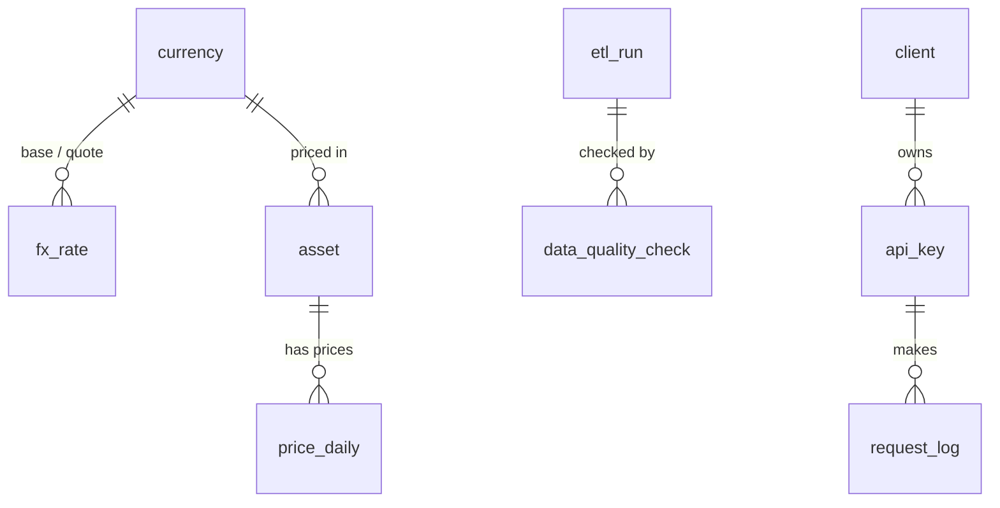

# 🚀 FinPulse — Phase 1 Report: Building the Restaurant 🏛️

> **Project:** FinPulse, a production-grade financial data platform on MySQL
> **Phase:** 1 of 7: Database Design
> **Status:** ✅ Complete
> **Deliverable:** `V001__initial_schema.sql`

---

## 📌 1. The Big Idea

> **FinPulse collects money data from the internet, cleans it, stores it safely, and sells access to it through an API.**

Think of any app that shows *"1 EUR = 1.18 USD"* or a stock chart 📈. Somebody built the system **behind** that number. That's what FinPulse is.

---

## 🍽️ 2. The Restaurant Analogy

Keep this picture in mind and the whole project makes sense:

| 🍽️ Restaurant | 💻 FinPulse |
|---|---|
| 🚚 Farmers deliver ingredients | 🌐 Internet APIs send us money data |
| 📦 Storage room: boxes stored as they arrive | `fin_raw`: data saved exactly as received |
| 👨‍🍳 Kitchen: wash, cut, cook | ⚙️ Pipeline: clean + check the data |
| 🍝 Ready dishes, perfect quality | `fin_core`: clean, trusted data |
| 📋 Manager's logbook | `fin_ops`: what ran, did it work? |
| 🧾 Customer list + membership cards | `fin_app`: clients + API keys |
| 🤵 Waiter | 🔌 API: clients ask, API answers |
| 🚫 Customers never enter the kitchen | 🔒 Clients never touch the database directly |

**Phase 1 = building the rooms and the shelves.** No cooking yet. 🏗️

---

## 🧭 3. The Journey of One Number

```
🌐 Frankfurter API (European Central Bank data)
   │  "Here are today's rates!"
   ▼
📦 fin_raw.api_response        → saved as-is, our backup 🛟
   ▼
👨‍🍳 Pipeline cleans + checks   → real currency? positive? duplicate?
   ▼
💎 fin_core.fx_rate            → 2026-09-18 | EUR | USD | 1.18 ✅
   ▼
🔌 API                          → "What's EUR→USD today?"
   ▼
📱 Client app                   → 1 EUR = 1.18 USD
```

Meanwhile, 📋 `fin_ops` writes in its diary: *"Run #57 ✅ finished, 30 rows loaded."*

---

## 🧠 4. Step 1: Think Before Building

| ❓ Question | 💡 Answer |
|---|---|
| What data do we have? | Exchange rates, stock and crypto prices |
| Who uses it? | Our pipeline, our API, our customers |
| What can go wrong? | Duplicates, fake data, messy API responses |

👉 Pros **think first, code later**. Bad design = pain forever 😵

---

## 🚪 5. Step 2: The 4 Rooms (Schemas)

```sql
CREATE DATABASE IF NOT EXISTS fin_core
  CHARACTER SET utf8mb4 COLLATE utf8mb4_0900_ai_ci;
```

🗣️ In human language: *"Build a room called `fin_core`. If it exists already, chill 😌. Support every language and symbol (€, ñ, فارسی, 🚀)."*

| Room | Nickname | Job |
|---|---|---|
| 📦 `fin_raw` | **The Storage** | Keep everything exactly as it arrived |
| 💎 `fin_core` | **The Treasure** | Only clean, correct data |
| 📋 `fin_ops` | **The Diary** | Remember every run and quality check |
| 👥 `fin_app` | **The Front Desk** | Customers, keys, usage |

🤔 **Why separate rooms?** Same reason a restaurant doesn't keep raw chicken next to dessert 🍗🍰. Separation = safety + order.

🧠 **Vocabulary:** schema = a room · table = a shelf · row = one item on the shelf.

---

## 🗄️ 6. Step 3: The 10 Shelves (Tables)

| Room | Table | Holds |
|---|---|---|
| 📋 fin_ops | `etl_run` | Every pipeline run 🏃 |
| | `data_quality_check` | Every quality test result ✅❌ |
| 📦 fin_raw | `api_response` | Raw JSON from the internet |
| 💎 fin_core | `currency` | Valid currencies (EUR, USD…) |
| | `fx_rate` | Daily exchange rates 💱 |
| | `asset` | Stocks + crypto we track |
| | `price_daily` | Their daily prices 📈 |
| 👥 fin_app | `client` | Our customers |
| | `api_key` | Their secret keys (hashed) 🔐 |
| | `request_log` | Every API call they make |

### 🗺️ How the shelves connect



---

## 🔍 7. Step 4: Designing Each Shelf

The star of the show ⭐ `fx_rate`:

```sql
CREATE TABLE fin_core.fx_rate (
    rate_date       DATE           NOT NULL,
    base_currency   CHAR(3)        NOT NULL,
    quote_currency  CHAR(3)        NOT NULL,
    rate            DECIMAL(20,10) NOT NULL,
    ...
);
```

One row looks like this:

| rate_date | base_currency | quote_currency | rate |
|---|---|---|---|
| 2026-09-18 | EUR | USD | 1.1800000000 |

➡️ On Sept 18, **1 EUR = 1.18 USD**.

### 🏷️ Data types we used

| Type | Human version | Example |
|---|---|---|
| `CHAR(3)` | Exactly 3 characters | `EUR` |
| `VARCHAR(n)` | Text up to n characters | `fx_rates_daily` |
| `TEXT` | Long text | error messages |
| `INT` / `BIGINT UNSIGNED` | Whole numbers ≥ 0 (big / huge) | IDs, counts |
| `SMALLINT` | Small numbers | `200`, `404` |
| `DECIMAL(20,10)` | **Exact** decimals 🎯 | `1.1800000000` |
| `DATE` | A day | `2026-09-18` |
| `DATETIME(3)` | Date + time + milliseconds | `2026-09-18 14:03:22.451` |
| `BOOLEAN` | True / false | `is_active` |
| `ENUM(...)` | One value from a fixed list | `'success'` |
| `JSON` | A whole JSON document | raw API response |

💸 **Why DECIMAL, not FLOAT?** FLOAT is the friend who says *"it's about 1.18… ish"* 🤷. In finance, "ish" loses real money. DECIMAL is **exact**.

### 🚦 Basic rules

| Rule | Human version |
|---|---|
| `NOT NULL` | "You can't leave this empty" 🚫 |
| `DEFAULT` | "If you forget, I'll fill it in" 🤝 |
| `AUTO_INCREMENT` | "I'll number rows for you: 1, 2, 3…" 🔢 |
| `ON UPDATE CURRENT_TIMESTAMP` | "I'll note the time whenever you change me" ⏰ |

---

## 🛡️ 8. Step 5: The Bodyguards

The database **defends itself** 💪

| Bodyguard | Code | Human version |
|---|---|---|
| 🔑 **Primary key** | `PRIMARY KEY (rate_date, base_currency, quote_currency)` | "Only ONE EUR→USD rate per day. No twins." |
| 🔗 **Foreign key** | `FOREIGN KEY (quote_currency) REFERENCES currency (currency_code)` | "`XXX`? Not on my list. Get out." 🚪 |
| ✋ **Check** | `CHECK (rate > 0)` | "A negative rate? Nice try." 😏 |
| 🧬 **Unique** | `UNIQUE KEY (contact_email)` | "Two clients can't share an email." |
| ⚡ **Index** | `INDEX (base_currency, quote_currency, rate_date)` | "Shortcut to find EUR→USD fast", like a book index 📖 |

💡 A primary key with 3 columns is a **composite key**: the *combination* must be unique. That's what makes re-running the pipeline safe 🔁

---

## 🔐 9. Step 6: Smart Security Moves

| Trick | Why it's smart 🧠 |
|---|---|
| API keys stored as a **SHA-256 hash** | Stolen database = scrambled nonsense, not real keys |
| `run_id` on every row | Trace any number back to the run that loaded it 🕵️ (**lineage**) |
| Raw JSON kept forever | Cleaning bug? Replay from raw, no new API calls 🛟 |
| Timestamps everywhere (UTC) | Every row remembers when it was born ⏰ |
| `utf8mb4` + `InnoDB` | Full character support + transactions + foreign keys |

---

## 🌱 10. Step 7: Seed Data

```sql
INSERT INTO fin_core.currency (currency_code, currency_name) VALUES
    ('EUR','Euro'), ('USD','US Dollar'), ('GBP','Pound Sterling'),
    ('JPY','Japanese Yen'), ('CHF','Swiss Franc'), ('CNY','Chinese Yuan Renminbi');
```

The foreign-key bodyguard 🔗 checks this list. Empty list = **every** rate rejected 😅, so currencies go in first.

---

## 🧪 11. Step 8: We Tried to Break It

Tested on **MySQL 8.0** in a temporary sandbox (a throwaway test lab 🧪):

| Attack 🗡️ | Result |
|---|---|
| Insert a normal rate | ✅ Accepted |
| Insert the same rate again (upsert) | 🔁 Updated, no duplicate |
| Currency `XXX` | ❌ Blocked by foreign key |
| Rate = `-1` | ❌ Blocked by CHECK |

The upsert pattern the pipeline will use every day:

```sql
INSERT INTO fin_core.fx_rate (rate_date, base_currency, quote_currency, rate, source)
VALUES ('2026-09-18', 'EUR', 'USD', 1.18, 'frankfurter') AS new
ON DUPLICATE KEY UPDATE rate = new.rate;
```

**Our database survived.** 🏆

---

## 📦 12. Step 9: Saved as a Migration

File name: `V001__initial_schema.sql`

Like **save points in a video game** 🎮:

| Version | Meaning |
|---|---|
| `V001` | First version of the database |
| `V002` | Next change (e.g. users + permissions) |
| `V003` | …and so on |

Anyone can rebuild the **exact same database** from zero by running them in order 👥

### 🧑‍🔬 Environments (how companies test)

| Environment | Purpose |
|---|---|
| 🧪 **Dev** | Play, break, experiment (the sandbox, your PC) |
| 🧫 **Staging** | Final test, a copy of production |
| 🏭 **Production** | The real thing, real customers |

---

## ▶️ 13. How to Run It Yourself

1. Open **MySQL Workbench** and connect to your local instance
2. **File → Open SQL Script** → pick `V001__initial_schema.sql`
3. Run everything with `Ctrl+Shift+Enter` ⚡
4. Refresh the **Schemas** panel 🔄 and you'll see `fin_raw`, `fin_core`, `fin_ops`, `fin_app`
5. **Database → Reverse Engineer** → select the 4 schemas → see your ER diagram 🗺️
6. Try breaking it:

```sql
INSERT INTO fin_core.fx_rate (rate_date, base_currency, quote_currency, rate, source)
VALUES ('2026-09-18', 'EUR', 'USD', -5, 'manual');
-- ❌ Check constraint 'chk_fx_rate_positive' is violated.
```

---

## 🏁 14. Phase 1 Scorecard

| What we did | 🎯 |
|---|---|
| Thought about the business first | ✅ |
| Built 4 rooms (schemas) | ✅ |
| Added 10 shelves (tables) | ✅ |
| Chose the right data types | ✅ |
| Hired bodyguards (keys + checks) | ✅ |
| Added security tricks | ✅ |
| Seeded currencies | ✅ |
| Tried to break it (and failed 😎) | ✅ |
| Saved as a versioned migration | ✅ |

**The restaurant is built. The shelves are ready. The kitchen is empty.** 🍽️

---

## 🗺️ 15. The Road Ahead

| # | Mission | Status |
|---|---|---|
| 1 | 🏛️ Design the database | ✅ Done |
| 2 | 🔐 Security: users + permissions | 👉 Next |
| 3 | 🐍 Pipeline: pull real data from the internet | 🔜 |
| 4 | 🧹 Cleaning + quality checks | 🔜 |
| 5 | 🔌 Build the API (the waiter) | 🔜 |
| 6 | ☁️ Put it online for real clients | 🔜 |
| 7 | 📊 Monitoring, backups, speed | 🔜 |

### 🎬 Next episode: "Who gets the keys?" 🗝️

No more logging in as `root` (the master key 🙅). We'll create:

- 🤖 **pipeline_user**: writes data, can't touch customers
- 🔌 **api_user**: only **reads** clean data
- 👀 **analyst_user**: can look, can't change anything

Every user gets only the keys they need. Nothing more. 🔐
